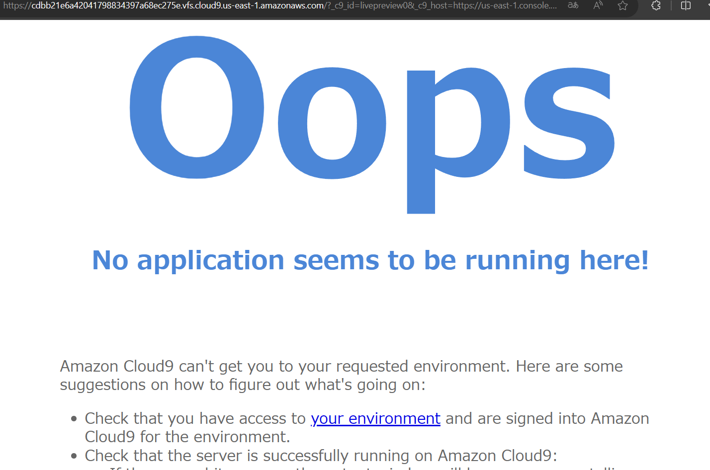
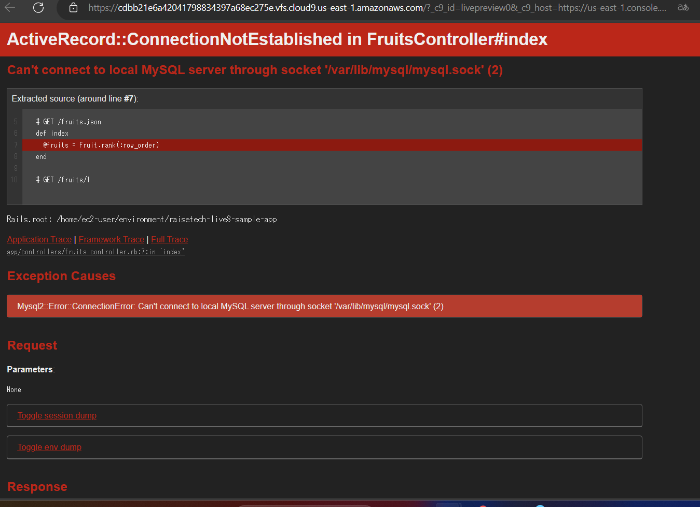
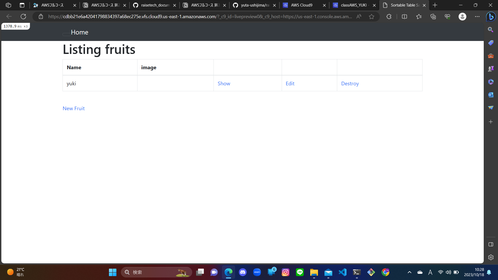

# Lecture 03 課題提出　Yuki.K(AWS.23.10)
## APサーバーについて調べてみましょう
* Web3層構造と呼ばれるWebシステムで、アプリケーションの実行環境を提供するサーバーソフトウェア。
## APサーバーの名前とバージョンを確認してみましょう。
* Puma（version 5.6.5）
* （コマンド"puma --version"で確認。）
## APサーバーを終了させた場合、引き続きアクセスできますか？結果を確認して、またAPサーバーを起動してください。
* APサーバーを終了させた場合、引き続きアクセスはできない。
* (No application seems to be running here!と表示された)
* ディレクトリ/raisetech-live8-sample-app/上で、「rails s」を再び入力し、APサーバーを起動することで、再度表示できた。

## DBサーバーについて調べてみましょう。
* データを一元管理し、データの検索、更新、保存、バックアップを行うサーバーのこと。Web3層構造のWebシステムでは最下層に位置し、APサーバーからの要求に基づき、データの検索やデータの更新（追加、修正、削除）を行っている。RDB を管理する為のシステムを略して「RDBMS」と呼び、今回使用しているMySQL以外にも、Oracle DataBaseなど様々ある。
## サンプルアプリケーションで使ったDBサーバーの名前と、今Cloud9で動作しているバージョンはいくつか確認してみましょう。
* mySQL（server version8.0.34）
* （コマンド"mysql --version"で確認）
## DBサーバーを終了させた場合、引き続きアクセスできますか？
* できない。
* （Can't connect to local MySQL server through socket'/var/lob/mysql/mysql.sok'(2)と表示される。）

## Rails の構成管理ツールの名前は何でしたか？確認してみてください。
* Bundler
## 今回の課題から学んだことを報告してください。
* 初めは暗号のようだったコードも、エラーの際には説明が表示され、一つずつ対処することで解決できることがわかった。また、デモンストレーションの動画を見よう見まねで、サンプルアプリケーションの起動までたどりついてしまい、あやふやだったところが、課題の最後にサーバーや構成管理ツールについて復習したことで、もう少し理解が深まったと思う。
## サンプルアプリケーションへのアクセス画像
